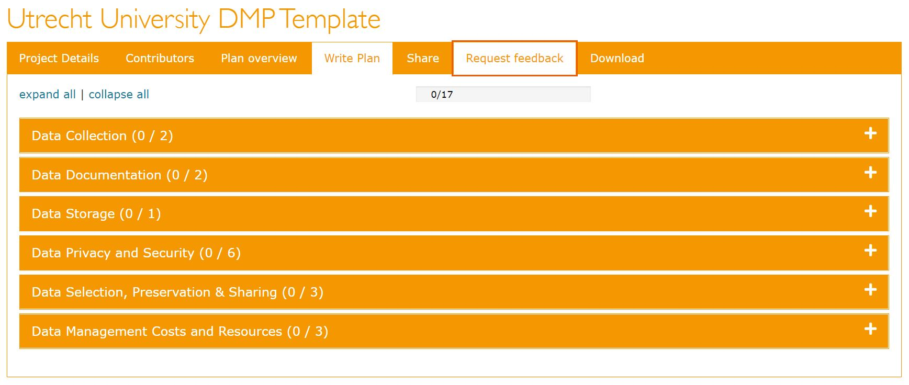

# Data Management Plans

## What Is A Data Management Plan?

A Data Management Plan (DMP) is a formal document that describes your data and outlines all aspects of managing your data - both during and after your project.

Moreover, it is a _living_ document that can you can revise and update as needed.

<figcaption><a href="https://the-turing-way.netlify.app/">The Turing Way</a> project illustration by Scriberia. Used under a CC-BY 4.0 licence. DOI: <a href="https://doi.org/10.5281/zenodo.3332807">10.5281/zenodo.3332807</a>.</figcaption>

## Why Should You Write A DMP?

Writing a DMP provides an opportunity to reflect on your data, particularly how you organize and manage it. It nudges you to think about how to make your RDM more _concrete_ and _actionable_. This creates efficiency and more value for your data.

## When Should You Write A DMP?

Working on a DMP at the start of your project will ensure that you are better informed of best practices in RDM and prepared to implement them. That being said, you can also write a DMP can during the project or when it's completed.

## DMPonline & DMP Templates

DMPonline is a tool that helps you create and maintain DMPs. With DMPonline, you can:

- register and sign in with your institutional credentials,
- write and collaborate on (multiple) DMPs,
- share DMPs or switch their visibility between private and public,
- request feedback from RDM Support,
- download DMPs in various formats.

DMPonline offers DMP templates from various institutions and funders, including:

- Utrecht University
- UMC Utrecht
- [NWO](https://dmponline.dcc.ac.uk/template_export/1753695087.pdf)
- [ZonMw](https://dmponline.dcc.ac.uk/template_export/1461074155.pdf)
- [ERC](https://dmponline.dcc.ac.uk/template_export/2088403152.pdf)
- [Horizon 2020](https://dmponline.dcc.ac.uk/template_export/1612436782.pdf)
- [Horizon Europe](https://dmponline.dcc.ac.uk/template_export/5992485.pdf)

These templates also contain example answers and guidance.

## Tips

!!! note "Tips"

    - Contact your DoY data manager! They can (co)write your DMP and/or review it.
    - If the DoY data manager is unavailable, you can still request feedback from RDM Support.

## Resources

- [Create your DMP online](https://www.uu.nl/en/research/research-data-management/tools-services/tool-to-create-your-dmp-online)
- [Data management planning](https://www.uu.nl/en/research/research-data-management/guides/data-management-planning)
- [Learn to write your DMP (online training)](https://www.uu.nl/en/research/research-data-management/training-workshops/online-training-learn-to-write-your-dmp) 

## References

1. [https://www.uu.nl/en/research/research-data-management/guides/data-management-planning](https://www.uu.nl/en/research/research-data-management/guides/data-management-planning)

2. [https://www.kuleuven.be/rdm/en/faq/faq-dmp](https://www.kuleuven.be/rdm/en/faq/faq-dmp)

3. [https://rdm.uva.nl/en/planning/data-management-plan/data-management-plan.html](https://rdm.uva.nl/en/planning/data-management-plan/data-management-plan.html)

4. [https://www.uu.nl/en/research/research-data-management/tools-services/tool-to-create-your-dmp-online.html](https://www.uu.nl/en/research/research-data-management/tools-services/tool-to-create-your-dmp-online.html)
